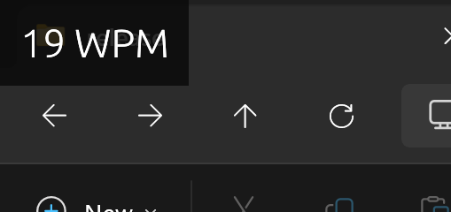

# KeyTracker

A simple WPM (words per minute) overlay for Windows, built with Rust.

## What it does

- Displays current wpm as you type
- Always on top overlay



#### Coming soon:

- Drag and drop to position
- Customize size, color, background, etc
- Cursor following WPM counter

## Usage


### From releases

Download the latest release from the [releases page](https://github.com/sudeepchalla/KeyTracker/releases) and run `KeyTracker.exe`.

### Build from source

1. Clone the repo

```
git clone https://github.com/sudeepchalla/KeyTracker.git
cd KeyTracker
```

2. Build

```
cargo build --release
```

3. Run

```
./target/release/KeyTracker.exe
```

Or just double-click the exe in `target/release/`.

